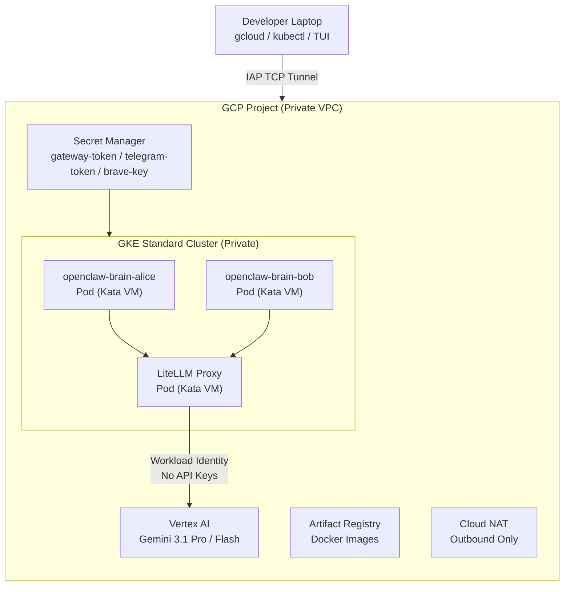
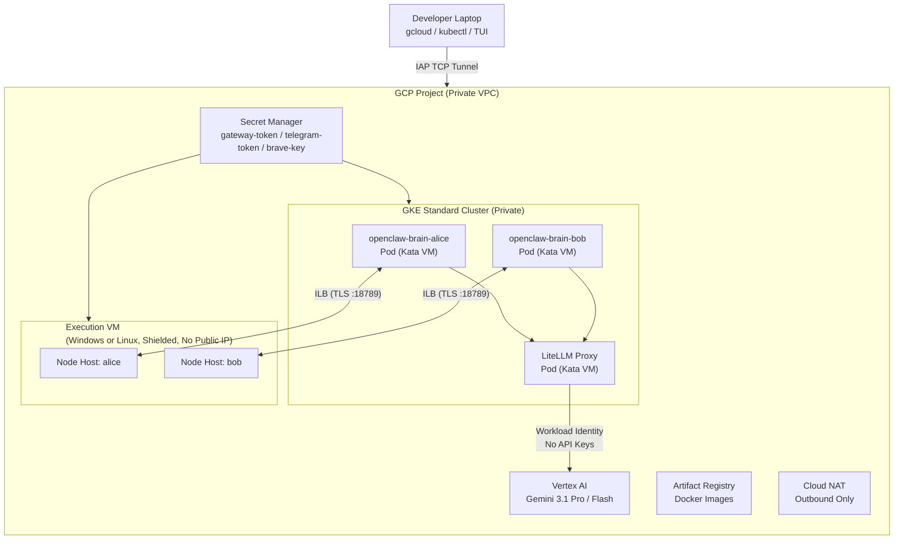
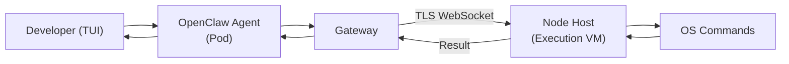

# OpenClaw on GCP -- Multi-Tenant GKE Deployment with Optional Execution VM

Terraform-managed infrastructure for deploying OpenClaw on Google Cloud Platform. The default deployment runs OpenClaw brain pods on a GKE Standard cluster with Kata Containers (VM-level isolation). Optionally, you can add an execution VM (Windows or Linux) for OS-native command execution via node hosts.

## Table of Contents

- [Architecture](#architecture)
- [Execution VM (Optional)](#execution-vm-optional)
- [Multi-Tenant Design](#multi-tenant-design)
- [Security Features](#security-features)
- [Deployment Guide](#deployment-guide)
- [End-to-End Testing](#end-to-end-testing)
  - [Connecting to the GKE Cluster](#connecting-to-the-gke-cluster)
  - [Troubleshooting](#troubleshooting)
- [Telegram Channel Integration](#telegram-channel-integration)
- [Windows VM Golden Image](#windows-vm-golden-image)
- [Variables Reference](#variables-reference)
- [Outputs Reference](#outputs-reference)

---

## Architecture

### Default: GKE-Only (no execution VM)



### With Execution VM (`enable_exec_vm = true`)



### Component Summary

| Component | Purpose | Runtime |
|-----------|---------|---------|
| **OpenClaw Brain Pods** | AI agent gateway -- receives user messages, plans actions, dispatches to tools | GKE + Kata Containers (VM-level isolation) |
| **LiteLLM Proxy** | Routes LLM requests to Vertex AI Gemini models via Workload Identity (no API keys) | GKE + Kata Containers |
| **Execution VM** *(optional)* | Executes OS-native commands dispatched by agents (Windows: PowerShell/CMD, Linux: bash) | GCE, Shielded VM, no public IP |
| **Node Hosts** *(optional)* | Per-developer `openclaw node run` processes on the execution VM, connecting back to gateway pods over TLS WebSocket | Windows: Scheduled Tasks, Linux: systemd services |
| **Internal Load Balancers** *(optional)* | Per-developer ILBs allowing VM node hosts to reach gateway pods inside GKE | GKE Service (type: LoadBalancer, internal) |
| **Secret Manager** | Stores gateway auth token, Telegram bot token, Brave API key | GCP managed service |
| **Artifact Registry** | Private Docker registry for OpenClaw container images | GCP managed service |
| **Cloud NAT** | Outbound internet for pods and VMs (no public IPs on any resource) | GCP managed service |

---

## Execution VM (Optional)

By default, only the GKE brain pods are deployed (`exec_vms = {}`). To add execution VMs, define them in the `exec_vms` map. You can deploy any combination of Windows and Linux VMs:

```hcl
exec_vms = {
  # Both Windows and Linux
  "windows" = { os_image = "windows-cloud/windows-2022-core" }
  "linux"   = { os_image = "debian-cloud/debian-12" }
}
```

```hcl
exec_vms = {
  # Linux only
  "linux" = {
    os_image          = "debian-cloud/debian-12"
    machine_type      = "e2-standard-4"
    boot_disk_size_gb = 100
  }
}
```

### OS Auto-Detection

The OS type is auto-detected from the image name:

| Image | OS | Node Host | Startup Script |
|-------|-----|-----------|----------------|
| Any image containing "windows" | Windows | Scheduled Tasks (SYSTEM) | `scripts/windows_startup.ps1` |
| Any other image | Linux | systemd services | `scripts/linux_startup.sh` |

Each VM is named `openclaw-exec-{key}` (e.g., `openclaw-exec-windows`, `openclaw-exec-linux`).

### What the Execution VMs Enable

When `exec_vms` is non-empty, Terraform creates:
- A GCE VM per entry (no public IP, Shielded VM)
- A shared subnet and firewall rule for VM-to-GKE connectivity
- A shared service account with logging/monitoring/Secret Manager access
- Per-developer Internal Load Balancer services on GKE
- Per-developer node host processes on each VM (auto-paired with gateway pods)

Each developer gets a connected node host on **every** VM — e.g., with both Windows and Linux VMs, alice sees `linux-alice` and `windows-alice` as connected nodes.

### Data Flow: Agent Command Execution (with VM)



### Automated Node Host Pairing

Node host pairing is fully automated -- no manual approval needed:

1. Gateway pod starts with a background auto-approve loop (`entrypoint.sh`)
2. VM startup script cleans stale device identity on every boot, then starts per-developer node hosts
3. Each node host connects to its developer's ILB, sends a pairing request
4. The auto-approve loop detects pending `role=node` requests and approves them within ~15 seconds
5. The node host reconnects and is fully operational

---

## Multi-Tenant Design

Each developer gets fully isolated resources, driven by the `var.developers` map:

```hcl
developers = {
  "alice" = { active = true }
  "bob"   = { active = true }
  "carol" = { active = false }  # Pod scaled to 0, PVC preserved
}
```

### Per-Developer Resources

| Resource | Naming | Purpose |
|----------|--------|---------|
| **Deployment** | `openclaw-brain-{name}` | Isolated AI agent pod with Kata runtime |
| **PVC** | `openclaw-pvc-{name}` | 10Gi persistent storage for workspace, state, sessions |
| **K8s Service (ILB)** *(VM only)* | `openclaw-gateway-{name}` | Internal Load Balancer for VM node host connectivity |
| **Node Host** *(VM only)* | `openclaw-node-{name}` | Node host process on execution VM |

### Shared Resources

| Resource | Purpose |
|----------|---------|
| LiteLLM Proxy | Single deployment proxying all LLM requests to Vertex AI |
| Execution VM *(optional)* | Shared execution environment (each developer gets their own node host process with isolated state) |
| Gateway TLS Certificate | Single self-signed cert with fingerprint pinning |
| Gateway Auth Token | Single token in Secret Manager, used by all pods and node hosts |

### Scaling

| Dimension | How |
|-----------|-----|
| Add developer | Add entry to `var.developers`, run `terraform apply` |
| Deactivate developer | Set `active = false` -- pod scales to 0, PVC preserved |
| Remove developer | Delete entry from map -- all resources destroyed |
| Add execution VMs | Add entries to `exec_vms` map with OS image |
| More VM capacity | Increase `exec_vm_machine_type` (e.g., `e2-standard-4`) |

---

## Security Features

### Network Security

- **No public IPs** on any resource (GKE nodes, Windows VM)
- **IAP-only access** -- SSH/RDP via Identity-Aware Proxy tunnel only (`35.235.240.0/20`)
- **Default-deny firewall** -- explicit allow rules for IAP SSH and Windows-to-GKE (port 18789)
- **Private GKE cluster** -- private nodes, master authorized networks restricted to VPC subnets and admin CIDRs
- **Cloud NAT** -- outbound internet without public IPs, NAT logging enabled
- **VPC flow logs** -- enabled on GKE subnet with full metadata

### Identity and Access

- **Dedicated service accounts** per component (brain, Windows VM, GKE nodes, Cloud Build) -- never uses default compute SA
- **Workload Identity** -- Kubernetes SA bound to GCP SA, no service account keys
- **Per-secret IAM** -- each Secret Manager secret has individual IAM bindings (not project-wide `secretAccessor`)
- **IAP tunnel access** -- optional deployer SA with `iap.tunnelResourceAccessor` role

### Compute Security

- **Kata Containers** -- VM-level isolation for all OpenClaw pods (nested virtualization on N2 nodes)
- **Non-root containers** -- OpenClaw image runs as UID 10001, enforced by pod `securityContext` (`runAsNonRoot: true`)
- **Shielded VMs** -- Secure Boot, vTPM, Integrity Monitoring on Windows VM and GKE default pool
- **GKE release channel** -- `REGULAR` channel for automatic security patching

### Secrets Management

- **GCP Secret Manager** for all credentials (gateway token, Telegram token, Brave API key)
- **Auto-generated gateway token** -- 48-char hex token if not provided
- **TF_VAR environment variables** for sensitive inputs (never in `terraform.tfvars`)
- **Remote state** -- GCS backend with versioning (configure bucket via `terraform init -backend-config="bucket=YOUR_BUCKET"`)

### Application Security

- **TLS with fingerprint pinning** -- self-signed ECDSA P256 cert, SHA256 fingerprint validated by node hosts
- **Token authentication** -- gateway requires auth token for all connections
- **Exec security** -- gateway and node hosts use `full` security with `ask: "off"` (auto-approve); configurable per-agent via `exec-approvals.json`
- **Restricted envsubst** -- only named variables substituted (`$MODEL_PRIMARY,$MODEL_FALLBACKS,$GATEWAY_AUTH_TOKEN`)
- **Container vulnerability scanning** -- `containerscanning.googleapis.com` API enabled on Artifact Registry
- **Pinned LiteLLM image** -- SHA256 digest, not mutable tag
- **Cluster deletion protection** -- `deletion_protection = true`
- **Automated node pairing** -- background auto-approve for `role=node` devices only; operator devices still auto-approved by gateway

### Exec Approval Configuration

OpenClaw has a two-layer exec approval system — both the **gateway** and each **node host** independently control whether commands require approval. This deployment pre-configures both sides for auto-approve via `exec-approvals.json`.

#### Settings Reference

| Setting | Value | Effect |
|---------|-------|--------|
| `security` | `"full"` | Allow all commands without restriction |
| `security` | `"allowlist"` | Only allow commands listed in `safeBins` (requires `safeBinProfiles` in OpenClaw 2026.4+) |
| `ask` | `"off"` | Never prompt for approval |
| `ask` | `"always"` | Prompt for every command via TUI |
| `askFallback` | `"full"` | If approval prompt times out, auto-approve |
| `askFallback` | `"deny"` | If approval prompt times out, deny |

#### Changing Approval Behavior

**Via CLI on a node host:**

```bash
# Require approval for every command
openclaw config set tools.exec.ask always

# Restrict to allowlisted commands only
openclaw config set tools.exec.security allowlist

# Restore auto-approve
openclaw config set tools.exec.security full
openclaw config set tools.exec.ask off
```

**Via `exec-approvals.json`** (applied at startup by the entrypoint/startup scripts):

```json
{
  "version": 1,
  "defaults": {
    "security": "full",
    "ask": "off",
    "askFallback": "full"
  },
  "agents": {
    "main": {
      "security": "full",
      "ask": "off"
    }
  }
}
```

You can also configure per-agent policies under the `agents` key to apply different approval rules for specific agents.

> **Note:** Changes via CLI are ephemeral — the startup scripts re-apply `exec-approvals.json` on every restart. To make permanent changes, modify the approval config in the startup scripts (`scripts/entrypoint.sh`, `scripts/linux_startup.sh`, `scripts/windows_startup.ps1`).

---

## Deployment Guide

### Prerequisites

- [Terraform](https://developer.hashicorp.com/terraform/install) >= 1.5
- [Google Cloud SDK](https://cloud.google.com/sdk/docs/install) (`gcloud`)
- A GCP project with billing enabled
- `kubectl` installed
- Authenticated credentials:
  ```bash
  gcloud auth application-default login
  gcloud auth login
  ```

### Step 1: Create GCS Backend Bucket

The Terraform state is stored in a GCS bucket. Create it before initializing:

```bash
PROJECT_ID="my-gcp-project"
BUCKET="${PROJECT_ID}-tf-state"

gsutil mb -p "$PROJECT_ID" -l asia-southeast1 "gs://$BUCKET"
gsutil versioning set on "gs://$BUCKET"
```

### Step 2: Clone and Configure

```bash
git clone <repository-url>
cd terraform-openclaw-gcp-gke
```

Create your variables file:

```bash
cp terraform.tfvars.example terraform.tfvars
```

Edit `terraform.tfvars` with your project settings:

```hcl
project_id = "my-gcp-project"
region     = "asia-southeast1"
zone       = "asia-southeast1-a"

openclaw_version = "latest"
model_primary    = "litellm/gemini-3.1-pro-preview"
model_fallbacks  = "[\"litellm/gemini-3.1-flash-lite-preview\"]"

developers = {
  "alice" = { active = true }
  "bob"   = { active = true }
}

# ── Optional: Execution VMs ─────────────────────────────────────────────────
# Uncomment to add VMs for OS-native command execution.

# exec_vms = {
#   "windows" = { os_image = "windows-cloud/windows-2022-core" }
#   "linux"   = { os_image = "debian-cloud/debian-12" }
# }
```

Set sensitive variables via environment:

```bash
export TF_VAR_telegram_bot_token="your-telegram-bot-token"  # optional
export TF_VAR_gateway_auth_token=""  # leave empty to auto-generate
export TF_VAR_brave_api_key=""       # optional
```

### Step 3: Initialize and Deploy

```bash
terraform init -backend-config="bucket=${PROJECT_ID}-tf-state"
terraform plan
terraform apply
```

This creates all infrastructure (~15-20 minutes):
- VPC, subnets, firewall rules, Cloud NAT
- GKE Standard cluster with Kata-enabled node pool
- Kata Containers installed via Helm
- Per-developer OpenClaw pods and PVCs
- LiteLLM proxy deployment
- Secret Manager secrets and IAM bindings
- *(If `exec_vms` is non-empty)* Execution VMs, per-developer ILB services, VM subnet/firewall/SA

### Step 4: Build and Push the OpenClaw Container Image

> **Skip this step** if you set `sandbox_image` to a custom pre-built image in your `terraform.tfvars`.

When no `sandbox_image` is specified (default), you must build and push the vanilla OpenClaw image to your Artifact Registry:

```bash
export PROJECT_ID="my-gcp-project"
export REGION="asia-southeast1"
./scripts/build_and_push.sh
```

### Step 5: Restart Pods to Pull the New Image

```bash
kubectl rollout restart deployment -n openclaw -l component=brain
```

### Step 6: Verify Deployment

See [Connecting to the GKE Cluster](#connecting-to-the-gke-cluster) and [Verify Pods Are Running](#verify-pods-are-running) in the End-to-End Testing section below.

### Step 7: Verify Node Host Pairing (only if `exec_vms` is non-empty)

Wait 3-5 minutes for the VM startup script to install OpenClaw, clean stale identity, and start node hosts. Pairing is fully automated:

```bash
# Check alice's node connection
kubectl exec -n openclaw deployment/openclaw-brain-alice -- npx openclaw nodes status

# Expected: Known: 1 · Paired: 1 · Connected: 1
# Node: windows-alice (or linux-alice), Status: paired · connected

# Check bob
kubectl exec -n openclaw deployment/openclaw-brain-bob -- npx openclaw nodes status
```

If nodes show "disconnected", check the gateway logs for auto-approve activity:

```bash
kubectl logs -n openclaw deployment/openclaw-brain-alice --tail=20 | grep -E "auto-pair|auto-approved|pairing"
```

---

## End-to-End Testing

### Connecting to the GKE Cluster

After `terraform apply` completes, configure `kubectl` to connect to the cluster:

```bash
# Get cluster credentials
gcloud container clusters get-credentials openclaw-cluster \
  --region $(terraform output -raw gke_cluster_region 2>/dev/null || echo "us-central1") \
  --project $(terraform output -raw project_id 2>/dev/null || echo "$PROJECT_ID")

# Verify connectivity
kubectl cluster-info
kubectl get namespaces | grep openclaw
```

> **Important:** Your client IP must be in the `master_authorized_cidrs` list or within the GKE/exec-VM subnets. If you're using Cloud Shell, add its CIDR to `master_authorized_cidrs` in your `terraform.tfvars`:
>
> ```hcl
> master_authorized_cidrs = {
>   "Cloud Shell" = "34.80.0.0/16"   # Adjust for your region
>   "Office VPN"  = "203.0.113.0/24"
> }
> ```

### Verify Pods Are Running

```bash
# Check all pods in the openclaw namespace
kubectl get pods -n openclaw

# Expected output:
# NAME                                    READY   STATUS    AGE
# litellm-xxxxx                           1/1     Running   5m
# openclaw-brain-alice-xxxxx              1/1     Running   5m
# openclaw-brain-bob-xxxxx                1/1     Running   5m

# Verify Kata runtime is active
kubectl get pods -n openclaw -o jsonpath='{range .items[*]}{.metadata.name}{" -> "}{.spec.runtimeClassName}{"\n"}{end}'

# Verify non-root
kubectl exec -n openclaw deployment/openclaw-brain-alice -- id
# uid=10001(openclaw) gid=10001(openclaw) groups=10001(openclaw)

# Check ILB services have IPs (only if exec_vms is non-empty)
kubectl get svc -n openclaw
```

### Test via Node Invoke (non-interactive)

```bash
# Get alice's connected node ID
ALICE_NODE=$(kubectl exec -n openclaw deployment/openclaw-brain-alice -- \
  npx openclaw nodes status --json 2>/dev/null | jq -r '.nodes[] | select(.connected) | .id')

# Invoke system.which on Windows
kubectl exec -n openclaw deployment/openclaw-brain-alice -- \
  npx openclaw nodes invoke --node "$ALICE_NODE" \
  --command system.which --params '{"bins":["cmd","powershell","node"]}'

# Expected: {"ok":true, "payload":{"bins":{"cmd":"C:\\Windows\\system32\\cmd.exe",...}}}
```

### Test via OpenClaw TUI (interactive)

```bash
# Launch the TUI inside alice's pod
kubectl exec -it -n openclaw deployment/openclaw-brain-alice -- npx openclaw tui
```

Once in the TUI:

1. **Test command execution:**
   ```
   You: Run "hostname" on the Windows node host
   ```

2. **Approve the command:** The agent will prepare the command and request approval. An approval box will appear in the TUI output:
   ```
   ┌─ exec ──────────────────────────────
   │ hostname
   │ host: windows-alice
   │ id: a1b2c3
   │ ─────────────────────────────────
   │ /approve a1b2c3 allow
   └─────────────────────────────────────
   ```
   Scroll up if needed to find the approval box and note the **id** (e.g., `a1b2c3`). Then type:
   ```
   /approve a1b2c3 allow
   ```
   Replace `a1b2c3` with the actual id shown in your approval box.

3. **Expected result:**
   ```
   Agent: The hostname is "openclaw-exec-windows"
   ```

4. **Test more commands:**
   ```
   You: Run "ver" on the Windows node to get the Windows version
   # Approve when prompted, then:
   Agent: Microsoft Windows [Version 10.0.20348.xxxx]
   ```

   ```
   You: Run "Get-Process | Select-Object -First 5" on the Windows node via PowerShell
   ```

5. **Exit:** Press `Ctrl+C` or type `/exit`

> **Tip:** If you cannot find the approval id, scroll up in the TUI — the approval box may be above the current viewport. The id is a short alphanumeric string shown in the exec approval block.

### Test Bob's Pod

Repeat the same steps for Bob:

```bash
kubectl exec -it -n openclaw deployment/openclaw-brain-bob -- npx openclaw tui
```

### Verify Isolation

Alice and Bob have separate:
- Pods (different deployments)
- PVCs (different persistent volumes)
- Node host processes on Windows (different scheduled tasks)
- Sessions and state (different `OPENCLAW_STATE_DIR` paths on both Linux and Windows)

### Troubleshooting

#### `kubectl` cannot connect / hangs / times out

Your IP is not in the GKE master authorized networks. Fix:

```bash
# Check your current public IP
curl -s ifconfig.me

# Add it to terraform.tfvars
master_authorized_cidrs = {
  "My IP" = "YOUR_IP/32"
}

# Apply the change (updates the cluster, no downtime)
terraform apply
```

If using Cloud Shell, add the Cloud Shell CIDR for your region (e.g., `34.80.0.0/16` for Asia, `35.235.240.0/20` for US). Check the [Cloud Shell IP ranges](https://cloud.google.com/shell/docs/limitations#ip_address_ranges) documentation.

#### Pods stuck in `Pending` or `ContainerCreating`

```bash
# Check events for the pod
kubectl describe pod -n openclaw <pod-name>

# Common causes:
# - "no nodes available": Node pool still provisioning (~5 min)
# - "kata-clh runtime class not found": Kata not yet installed, wait for Helm release
kubectl get runtimeclass kata-clh

# - Image pull error: Build and push the image first (Step 4)
kubectl get events -n openclaw --sort-by='.lastTimestamp' | tail -20
```

#### Node hosts show "disconnected"

```bash
# Check node status from the brain pod
kubectl exec -n openclaw deployment/openclaw-brain-alice -- npx openclaw nodes status

# Check gateway auto-approve logs
kubectl logs -n openclaw deployment/openclaw-brain-alice --tail=30 | grep -E "auto-pair|auto-approved|pairing"

# On Linux VM: check systemd service
gcloud compute ssh openclaw-exec-linux --zone=ZONE --tunnel-through-iap \
  -- sudo journalctl -u openclaw-node-alice -n 50

# On Windows VM: check scheduled task output
gcloud compute ssh openclaw-exec-windows --zone=ZONE --tunnel-through-iap \
  -- powershell "Get-Content C:\\openclaw\\nodes\\alice\\node-host.log -Tail 30"
```

Common causes:
- **Stale device identity** — restart the VM to trigger the startup script cleanup
- **ILB not ready** — wait 2-3 minutes for the internal load balancer IP to provision (`kubectl get svc -n openclaw`)
- **Gateway token mismatch** — verify the token in Secret Manager matches what the VM fetched at boot

#### Exec VM cannot reach GKE API

```bash
# Verify firewall rule exists
gcloud compute firewall-rules list --filter="name~exec-vm" --project=$PROJECT_ID

# Verify the VM subnet is in master_authorized_networks
gcloud container clusters describe openclaw-cluster --region=REGION \
  --format="yaml(masterAuthorizedNetworksConfig)"
```

#### LiteLLM returning errors

```bash
# Check LiteLLM logs
kubectl logs -n openclaw deployment/litellm --tail=50

# Test Vertex AI connectivity from LiteLLM pod
kubectl exec -n openclaw deployment/litellm -- curl -s http://localhost:4000/health

# Verify Workload Identity is bound
kubectl describe sa openclaw-brain -n openclaw | grep annotation
```

---

## Telegram Channel Integration

### Step 1: Create a Telegram Bot

1. Open Telegram and message [@BotFather](https://t.me/BotFather)
2. Send `/newbot` and follow the prompts to choose a name and username
3. BotFather returns a token like: `123456789:AAExxxxxxxxxxxxxxxxxxxxxxxxxxxxxx`
4. Save this token -- do not commit it to version control

### Step 2: Store the Token

**Via environment variable (recommended):**

```bash
export TF_VAR_telegram_bot_token="123456789:AAExxxxxxxxxxxxxxxxxxxxxxxxxxxxxx"
terraform apply
```

Terraform creates the `openclaw-telegram-bot-token` secret in Secret Manager with proper per-secret IAM bindings.

**Via gcloud CLI (after deployment):**

```bash
echo -n "YOUR_TOKEN" | gcloud secrets create openclaw-telegram-bot-token \
  --project=my-gcp-project \
  --replication-policy=automatic \
  --data-file=-

gcloud secrets add-iam-policy-binding openclaw-telegram-bot-token \
  --project=my-gcp-project \
  --role=roles/secretmanager.secretAccessor \
  --member="serviceAccount:openclaw-brain@my-gcp-project.iam.gserviceaccount.com"
```

### Step 3: Configure the Channel

Update `openclaw.json.template` to add the Telegram channel:

```json
"channels": {
  "telegram": {
    "enabled": true,
    "tokenSecret": "openclaw-telegram-bot-token",
    "dmPolicy": "pairing",
    "groupPolicy": "allowlist",
    "streaming": "partial"
  }
}
```

Update `entrypoint.sh` to fetch the Telegram token from Secret Manager at runtime and write it to a file:

```bash
# After the existing config setup, add:
TELEGRAM_TOKEN=$(gcloud secrets versions access latest \
  --secret="openclaw-telegram-bot-token" --quiet 2>/dev/null || echo "")
if [ -n "$TELEGRAM_TOKEN" ]; then
  echo -n "$TELEGRAM_TOKEN" > "$STATE_DIR/telegram-bot-token.txt"
fi
```

Then update the channel config to reference the token file:

```json
"channels": {
  "telegram": {
    "enabled": true,
    "tokenFile": "/app/workspace/.openclaw-state/telegram-bot-token.txt",
    "dmPolicy": "pairing",
    "groupPolicy": "allowlist",
    "streaming": "partial"
  }
}
```

### Step 4: Rebuild and Deploy

```bash
export PROJECT_ID="my-gcp-project"
export REGION="asia-southeast1"
./scripts/build_and_push.sh

kubectl rollout restart deployment -n openclaw -l component=brain
```

### Step 5: Pair with the Bot

1. Open Telegram and start a chat with your bot
2. Send `/start` -- the bot will respond with a pairing code
3. Complete pairing via the TUI or agent CLI
4. You can now interact with your OpenClaw agent through Telegram

### Rotating the Telegram Token

```bash
# Add a new version
echo -n "NEW_TOKEN" | gcloud secrets versions add openclaw-telegram-bot-token \
  --project=my-gcp-project --data-file=-

# Restart pods to pick up the new version
kubectl rollout restart deployment -n openclaw -l component=brain

# Disable old version (optional)
gcloud secrets versions disable OLD_VERSION --secret=openclaw-telegram-bot-token \
  --project=my-gcp-project
```

---

## Windows VM Golden Image

This guide covers building a pre-configured Windows Server golden image with OpenClaw, Node.js, and all dependencies pre-installed, then deploying it to this project.

### Step 1: Create a Source VM

```bash
gcloud compute instances create openclaw-win-builder \
  --project=my-gcp-project \
  --zone=asia-southeast1-a \
  --machine-type=e2-standard-4 \
  --image-project=windows-cloud \
  --image-family=windows-2022-core \
  --boot-disk-size=50GB \
  --boot-disk-type=pd-balanced \
  --shielded-secure-boot \
  --shielded-vtpm \
  --shielded-integrity-monitoring \
  --no-address \
  --subnet=projects/my-gcp-project/regions/asia-southeast1/subnetworks/openclaw-vpc-windows-subnet
```

### Step 2: Connect and Install Software

```bash
# Set a Windows password
gcloud compute reset-windows-password openclaw-win-builder \
  --zone=asia-southeast1-a --quiet

# Connect via IAP RDP tunnel
gcloud compute start-iap-tunnel openclaw-win-builder 3389 \
  --zone=asia-southeast1-a --local-host-port=localhost:33389
# Then RDP to localhost:33389

# Or use PowerShell via IAP SSH (if OpenSSH is installed)
gcloud compute ssh openclaw-win-builder \
  --zone=asia-southeast1-a --tunnel-through-iap
```

Once connected, run the following in PowerShell:

```powershell
# Install Node.js 22 LTS
$nodeVersion = "22.15.0"
$nodeUrl = "https://nodejs.org/dist/v$nodeVersion/node-v$nodeVersion-x64.msi"
Invoke-WebRequest -Uri $nodeUrl -OutFile C:\Windows\Temp\node-installer.msi -UseBasicParsing
Start-Process msiexec.exe -ArgumentList "/i C:\Windows\Temp\node-installer.msi /qn /norestart" -Wait
$env:PATH = "C:\Program Files\nodejs;$env:PATH"
[Environment]::SetEnvironmentVariable("PATH", "C:\Program Files\nodejs;$([Environment]::GetEnvironmentVariable('PATH', 'Machine'))", "Machine")

# Install OpenClaw
npm install -g openclaw@latest --ignore-scripts

# Create state directory
New-Item -ItemType Directory -Path "C:\openclaw\state" -Force
New-Item -ItemType Directory -Path "C:\openclaw\nodes" -Force

# Configure exec approvals
$execApprovals = @"
{
  "version": 1,
  "defaults": {
    "security": "full",
    "ask": "off",
    "askFallback": "full"
  }
}
"@
$execApprovals | Set-Content -Path "C:\openclaw\state\exec-approvals.json" -Encoding UTF8

# Set environment variable
[Environment]::SetEnvironmentVariable("OPENCLAW_STATE_DIR", "C:\openclaw\state", "Machine")

# Run Sysprep preparation
& "C:\Program Files\nodejs\npx.cmd" openclaw approvals set "C:\openclaw\state\exec-approvals.json"
& "C:\Program Files\nodejs\npx.cmd" openclaw config set tools.exec.security full
& "C:\Program Files\nodejs\npx.cmd" openclaw config set tools.exec.ask off

# Clean up temp files
Remove-Item C:\Windows\Temp\node-installer.msi -Force -ErrorAction SilentlyContinue
Remove-Item C:\Windows\Temp\*.log -Force -ErrorAction SilentlyContinue
```

### Step 3: Sysprep and Create Image

```powershell
# On the VM -- generalize the image
& "$env:SystemRoot\System32\Sysprep\Sysprep.exe" /generalize /oobe /shutdown /quiet
```

Wait for the VM to shut down, then create the image:

```bash
gcloud compute images create openclaw-windows-golden-v1 \
  --project=my-gcp-project \
  --source-disk=openclaw-win-builder \
  --source-disk-zone=asia-southeast1-a \
  --family=openclaw-windows \
  --storage-location=asia-southeast1 \
  --labels=app=openclaw,managed-by=terraform \
  --description="OpenClaw Windows golden image with Node.js 22, OpenClaw, exec approvals pre-configured"
```

### Step 4: Clean Up the Builder VM

```bash
gcloud compute instances delete openclaw-win-builder \
  --zone=asia-southeast1-a --quiet
```

### Step 5: Update Terraform to Use the Golden Image

Edit `terraform.tfvars`:

```hcl
# In exec_vms map:
# "windows" = { os_image = "projects/my-gcp-project/global/images/family/openclaw-windows" }
```

Or pin to a specific image version:

```hcl
# "windows" = { os_image = "projects/my-gcp-project/global/images/openclaw-windows-golden-v1" }
```

Then apply:

```bash
terraform apply
```

The Windows VM will be recreated using the golden image. The startup script (`windows_startup.ps1`) will still run to:
- Update OpenClaw to the latest version
- Fetch the gateway token from Secret Manager
- Clean stale device identity from previous runs
- Configure per-developer node hosts with isolated state directories
- Start scheduled tasks that auto-reconnect on failure

### Step 6: Automate Image Updates (Optional)

Create a Cloud Build trigger or scheduled job to periodically rebuild the golden image with the latest patches:

```bash
# Schedule monthly image rebuild
gcloud scheduler jobs create http openclaw-golden-image-rebuild \
  --schedule="0 2 1 * *" \
  --uri="https://cloudbuild.googleapis.com/v1/projects/my-gcp-project/triggers/golden-image:run" \
  --http-method=POST \
  --oauth-service-account-email=openclaw-cloudbuild@my-gcp-project.iam.gserviceaccount.com
```

---

## Variables Reference

| Variable | Required | Default | Description |
|----------|----------|---------|-------------|
| `project_id` | Yes | -- | GCP project ID |
| `region` | No | `us-central1` | GCP region |
| `zone` | No | `us-central1-c` | GCE instance zone |
| `network_name` | No | `openclaw-vpc` | VPC network name |
| `gke_subnet_cidr` | No | `10.10.0.0/24` | GKE subnet CIDR |
| `gke_pods_cidr` | No | `10.100.0.0/16` | Secondary CIDR for pods |
| `gke_services_cidr` | No | `10.101.0.0/16` | Secondary CIDR for services |
| `gke_cluster_name` | No | `openclaw-cluster` | GKE cluster name |
| `gke_machine_type` | No | `n2-standard-4` | GKE node machine type (must support nested virt) |
| `gke_node_count` | No | `1` | Nodes per zone |
| **Execution VMs** | | | |
| `exec_vms` | No | `{}` | Map of execution VMs (see below) |
| `master_authorized_cidrs` | No | `{}` | Additional CIDRs allowed to access GKE control plane |
| `exec_vm_subnet_cidr` | No | `10.20.0.0/24` | VM subnet CIDR |
| **Secrets** | | | |
| `telegram_bot_token` | No | `""` | Telegram bot token (sensitive, use `TF_VAR_`) |
| `gateway_auth_token` | No | auto-generated | Gateway auth token (sensitive) |
| `brave_api_key` | No | `""` | Brave Search API key (sensitive) |
| **OpenClaw** | | | |
| `sandbox_image` | No | `""` (auto from Artifact Registry) | Custom Docker image for brain pods |
| `openclaw_version` | No | `latest` | OpenClaw npm package version |
| `model_primary` | No | `litellm/gemini-3.1-pro-preview` | Primary LLM model |
| `model_fallbacks` | No | `["litellm/gemini-3.1-flash-lite-preview"]` | Fallback models (JSON array) |
| `developers` | No | `{"default" = {active = true}}` | Map of developer names to config |
| `deployer_service_account` | No | `""` | SA email for IAP tunnel access |
| `labels` | No | `{app="openclaw",...}` | Resource labels |

## Outputs Reference

| Output | Description |
|--------|-------------|
| `gke_cluster_name` | GKE cluster name |
| `gke_cluster_endpoint` | GKE API server endpoint |
| `exec_vms` | Map of execution VM names to instance name, IP, and OS image |
| `artifact_registry_url` | Docker registry URL |
| `gateway_token_secret` | Secret Manager resource for gateway token |
| `cloudbuild_service_account` | Cloud Build service account email |
| `secrets_configured` | List of Secret Manager secrets created (sensitive) |

## Cleanup

> **Note:** Cluster deletion protection is enabled. To destroy, first disable it:

```bash
# Disable deletion protection
terraform apply -var="deletion_protection=false" -target=google_container_cluster.primary

# Then destroy
terraform destroy
```
