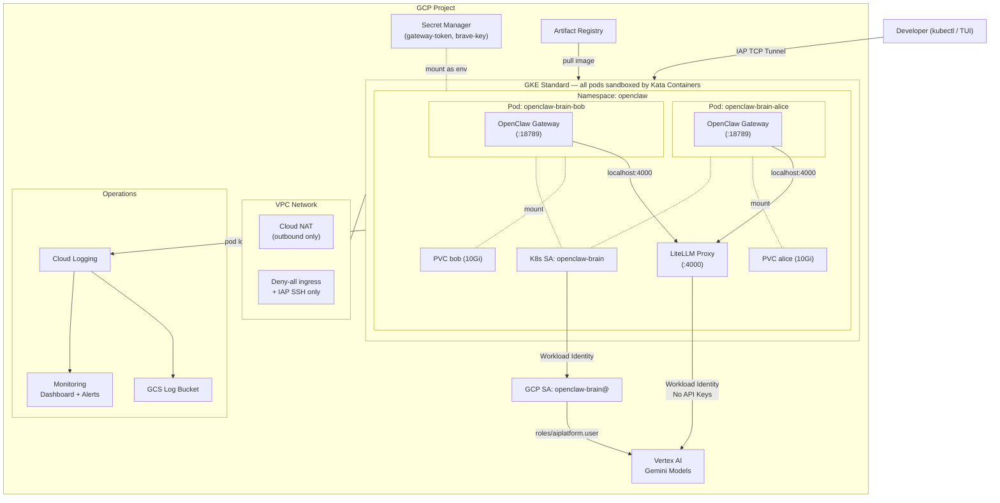
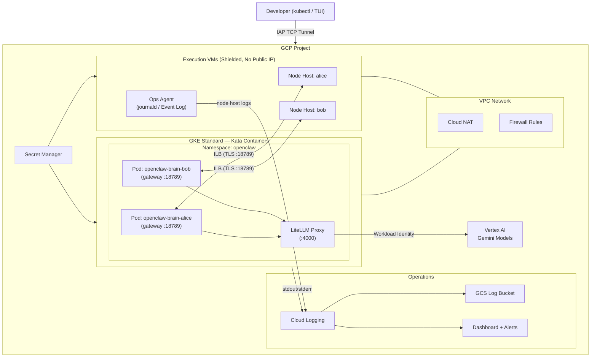
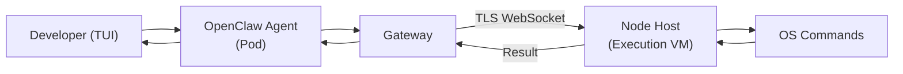
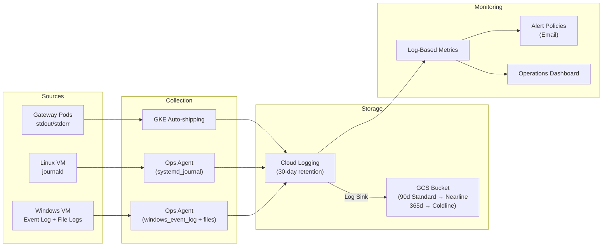

# OpenClaw on GCP — Multi-Tenant GKE with Kata Containers

Deploy [OpenClaw](https://docs.openclaw.ai) on Google Cloud with GKE Standard, Kata Containers (VM-level isolation), and Vertex AI — fully managed by Terraform. Optionally add execution VMs (Windows/Linux) for OS-native command execution.

---

## Table of Contents

- [Architecture](#architecture)
- [Security Features](#security-features)
- [Deployment Guide](#deployment-guide)
- [End-to-End Testing](#end-to-end-testing)
- [Adding Messaging Channels](#adding-messaging-channels)
  - [Telegram](#telegram)
- [Execution VM (Optional)](#execution-vm-optional)
- [Windows VM Golden Image](#windows-vm-golden-image)
- [Observability](#observability)
- [Variables Reference](#variables-reference)
- [Outputs Reference](#outputs-reference)
- [File Structure](#file-structure)
- [Cleanup](#cleanup)

---

## Architecture

[Back to top](#table-of-contents)

### Default: GKE-Only (no execution VM)



### With Execution VM (`enable_exec_vm = true`)



### Component Overview

| Component | Purpose |
|-----------|---------|
| **GKE Standard + Kata** | Managed Kubernetes with VM-level isolation via Kata Containers (nested virtualization on N2 nodes) |
| **LiteLLM Proxy** | Routes LLM requests to Vertex AI Gemini models via Workload Identity — no API keys |
| **Workload Identity** | Maps K8s ServiceAccount to GCP SA — no service account keys stored anywhere |
| **Per-Developer Pods** | Each developer gets an isolated pod + PVC with their own OpenClaw gateway instance |
| **Execution VM** *(optional)* | Windows or Linux VM for OS-native command execution (PowerShell, CMD, bash) |
| **Node Hosts** *(optional)* | Per-developer `openclaw node run` processes on VMs, connecting to gateway pods over TLS WebSocket |
| **Internal Load Balancers** *(optional)* | Per-developer ILBs for VM-to-GKE connectivity |
| **Cloud Monitoring** | Dashboard with 7 tiles, alert policies for crashes, disconnections, and exec denials |
| **Cloud Logging** | Logs routed to GCS with lifecycle policies (90d Nearline, 365d Coldline) |

[Back to top](#table-of-contents)

---

## Security Features

[Back to top](#table-of-contents)

### Kata Containers — VM-Level Sandboxing

Every OpenClaw pod runs inside a [Kata Container](https://katacontainers.io/) providing full VM isolation. Kata spins up a lightweight VM per pod using nested virtualization on N2 nodes:

- **Full kernel isolation** — Each pod gets its own guest kernel. Even if OpenClaw executes malicious code, it cannot reach the host kernel.
- **Stronger than gVisor** — Unlike syscall-filtering approaches, Kata provides a hardware-enforced VM boundary via KVM/QEMU.
- **Explicit opt-in** — Pods use `runtimeClassName: kata-clh`, configured by Terraform. No accidental fallback to the default runtime.

### Zero API Keys in the Cluster

The authentication chain uses identity federation — no API key secrets exist:

```
Pod → K8s ServiceAccount → Workload Identity → GCP Service Account → Vertex AI
```

- LiteLLM uses Application Default Credentials via the metadata server.
- Tokens are automatically refreshed — no key rotation needed.
- The only secrets stored are the gateway auth token (auto-generated) and optional Brave API key.

### Network Isolation

| Control | Implementation |
|---------|---------------|
| Private GKE nodes | Nodes have no public IPs |
| Cloud NAT | Outbound-only internet access for pulling images and calling Vertex AI |
| Deny-all ingress firewall | Only IAP SSH (`35.235.240.0/20`) and VM-to-GKE (`:18789`) allowed |
| Master authorized networks | Control plane restricted to GKE/VM subnets + explicitly listed CIDRs |
| Per-developer PVC isolation | Each developer's data is on a separate PersistentVolumeClaim |
| VPC flow logs | Enabled on GKE subnet with full metadata |

### IAM Least Privilege

| Service Account | Roles | Purpose |
|----------------|-------|---------|
| `openclaw-brain` | `aiplatform.user`, `logging.logWriter`, `monitoring.metricWriter` | Pod workload identity |
| `openclaw-exec-vm` | `logging.logWriter`, `monitoring.metricWriter` | VM log/metric shipping |
| Per-secret IAM | `secretmanager.secretAccessor` | Individual secret bindings, not project-wide |

### Application Security

| Layer | Protection |
|-------|-----------|
| **TLS + fingerprint pinning** | Self-signed ECDSA P256 cert, SHA256 fingerprint validated by node hosts |
| **Token authentication** | All WebSocket connections require `OPENCLAW_GATEWAY_TOKEN` from Secret Manager |
| **Non-root containers** | UID 10001, enforced by `runAsNonRoot: true` |
| **Shielded VMs** | Secure Boot, vTPM, Integrity Monitoring on GKE nodes and execution VMs |
| **Container scanning** | `containerscanning.googleapis.com` enabled on Artifact Registry |
| **Pinned LiteLLM image** | SHA256 digest, not mutable tag |
| **Cluster deletion protection** | `deletion_protection = true` |

### Device Auth Design Decision

This deployment sets `dangerouslyDisableDeviceAuth: true` — a deliberate choice for headless/server deployments, **not** a security oversight.

**Why:** With device auth enabled, every WebSocket connection requires interactive pairing approval. In a headless GKE deployment there is no UI to approve the first operator pairing — creating a chicken-and-egg problem.

**Why it is still secure:** The gateway sits on a private ILB (`10.10.0.0/24`), all connections require the gateway auth token from Secret Manager, and VPC firewall rules restrict access to pods and VMs on the VPC. For channel-level access control (e.g., Telegram), use `dmPolicy: "pairing"` on each channel.

> **Warning:** Never set `dangerouslyDisableDeviceAuth: false` in headless deployments — it will permanently lock out all connections if pairing data is lost.

[Back to top](#table-of-contents)

---

## Deployment Guide

[Back to top](#table-of-contents)

### Prerequisites

- [Terraform](https://developer.hashicorp.com/terraform/install) >= 1.5
- [gcloud CLI](https://cloud.google.com/sdk/docs/install) authenticated with a project owner account
- [kubectl](https://kubernetes.io/docs/tasks/tools/) installed
- A GCP project with billing enabled

### Step 1: Create the State Bucket

```bash
export PROJECT_ID="my-gcp-project"

# Create Terraform state bucket
gsutil mb -p "$PROJECT_ID" -l asia-southeast1 "gs://${PROJECT_ID}-tf-state"
gsutil versioning set on "gs://${PROJECT_ID}-tf-state"
```

[Back to top](#table-of-contents)

### Step 2: Clone and Configure

```bash
git clone https://github.com/zken-cloud/openclaw-gke-kata.git
cd openclaw-gke-kata
```

Edit `terraform.tfvars`:

```hcl
# Required
project_id = "my-gcp-project"

# Region
region = "asia-southeast1"
zone   = "asia-southeast1-a"

# Models
openclaw_version = "latest"
model_primary    = "litellm/gemini-3.1-pro-preview"
model_fallbacks  = "[\"litellm/gemini-3.1-flash-lite-preview\"]"

# Developers — each gets a dedicated pod and 10Gi PVC
developers = {
  "alice" = { active = true }
  "bob"   = { active = true }
}

# Control plane access (add your IP/CIDR)
master_authorized_cidrs = {
  "My IP" = "YOUR_IP/32"
}

# Optional: Execution VMs (uncomment to enable)
# exec_vms = {
#   "windows" = { os_image = "windows-cloud/windows-2022-core" }
#   "linux"   = { os_image = "debian-cloud/debian-12" }
# }

# Alerts (optional)
alert_email = "you@example.com"
```

Set sensitive variables via environment:

```bash
export TF_VAR_gateway_auth_token=""  # leave empty to auto-generate
export TF_VAR_brave_api_key=""       # optional
```

[Back to top](#table-of-contents)

### Step 3: Deploy

```bash
terraform init -backend-config="bucket=${PROJECT_ID}-tf-state"
terraform plan
terraform apply
```

This will:
1. Enable all required GCP APIs
2. Create VPC, subnet, Cloud NAT, firewall rules
3. Create GKE Standard cluster with Kata-enabled node pool (N2, nested virtualization)
4. Install Kata Containers via Helm
5. Deploy per-developer OpenClaw pods, PVCs, and ILB services
6. Deploy LiteLLM proxy with Workload Identity
7. Create Secret Manager secrets and IAM bindings
8. Set up monitoring dashboard, alert policies, and log sink
9. *(If `exec_vms` is non-empty)* Create execution VMs, subnet, firewall, and node hosts

Deployment takes approximately 15–20 minutes (GKE cluster creation is the bottleneck).

[Back to top](#table-of-contents)

### Step 4: Build and Push the Container Image

> **Skip this step** if you set `sandbox_image` to a custom pre-built image in your `terraform.tfvars`.

```bash
export PROJECT_ID="my-gcp-project"
export REGION="asia-southeast1"
./scripts/build_and_push.sh
```

[Back to top](#table-of-contents)

### Step 5: Restart Pods

```bash
kubectl rollout restart deployment -n openclaw -l component=brain
```

[Back to top](#table-of-contents)

### Step 6: Verify

```bash
# Get cluster credentials
gcloud container clusters get-credentials openclaw-cluster \
  --region $(terraform output -raw gke_cluster_region 2>/dev/null || echo "asia-southeast1") \
  --project $PROJECT_ID

# Check pods are running
kubectl get pods -n openclaw

# Expected:
# NAME                                    READY   STATUS    AGE
# litellm-xxxxx                           1/1     Running   5m
# openclaw-brain-alice-xxxxx              1/1     Running   5m
# openclaw-brain-bob-xxxxx                1/1     Running   5m

# Verify Kata runtime is active
kubectl get pods -n openclaw -o jsonpath='{range .items[*]}{.metadata.name}{" -> "}{.spec.runtimeClassName}{"\n"}{end}'

# Verify non-root
kubectl exec -n openclaw deployment/openclaw-brain-alice -- id
# Expected: uid=10001(openclaw) gid=10001(openclaw)
```

[Back to top](#table-of-contents)

### Step 7: Approve Node Host Pairing (only if `exec_vms` is non-empty)

Wait 3–5 minutes for the VM startup script to install OpenClaw and start node hosts. Each node host will attempt to connect to its developer's gateway pod and request pairing approval.

#### Option A: Approve via TUI

```bash
kubectl exec -it -n openclaw deployment/openclaw-brain-alice -- npx openclaw tui
```

Once in the TUI, you will see a pairing request notification. Type the approval command shown (e.g., `/approve <request-id> allow`).

#### Option B: Approve via CLI

```bash
# List pending pairing requests
kubectl exec -n openclaw deployment/openclaw-brain-alice -- npx openclaw nodes pending

# Approve a pending request by ID
kubectl exec -n openclaw deployment/openclaw-brain-alice -- npx openclaw nodes approve <REQUEST_ID>
```

> **Tip:** The node host retries every 10 seconds. If `nodes pending` shows no requests, wait a moment and try again — the request may appear briefly between retries.

#### Verify Connection

```bash
# Check alice's nodes
kubectl exec -n openclaw deployment/openclaw-brain-alice -- npx openclaw nodes status
# Expected: linux-alice and/or windows-alice showing "paired · connected"

# Check bob
kubectl exec -n openclaw deployment/openclaw-brain-bob -- npx openclaw nodes status
```

[Back to top](#table-of-contents)

---

## End-to-End Testing

[Back to top](#table-of-contents)

Step-by-step guide to verify every feature after deployment.

### Prerequisites

```bash
# Ensure you have cluster access
gcloud container clusters get-credentials openclaw-cluster \
  --region asia-southeast1 --project $PROJECT_ID

# Verify pods are running
kubectl get pods -n openclaw
# Expected: openclaw-brain-alice, openclaw-brain-bob, and litellm in Running state
```

[Back to top](#table-of-contents)

### Test 1: LiteLLM Proxy Health

```bash
kubectl exec -n openclaw deployment/litellm -- curl -s http://localhost:4000/health
```

Expected: `{"status":"ok"}`

[Back to top](#table-of-contents)

### Test 2: Kata Container Verification

```bash
# Verify runtime class exists
kubectl get runtimeclass kata-clh

# Verify pods use Kata
kubectl get pods -n openclaw -o jsonpath='{range .items[*]}{.metadata.name}{" -> "}{.spec.runtimeClassName}{"\n"}{end}'

# Verify kernel isolation (dmesg should be blocked)
kubectl exec -n openclaw deployment/openclaw-brain-alice -- dmesg 2>&1 | head -5
# Expected: "dmesg: read kernel buffer failed: Operation not permitted"
```

[Back to top](#table-of-contents)

### Test 3: OpenClaw TUI (Interactive)

```bash
# Launch the TUI inside alice's pod
kubectl exec -it -n openclaw deployment/openclaw-brain-alice -- npx openclaw tui
```

In the TUI:

1. **Test basic conversation:**
   ```
   You: Hello, what model are you using?
   ```
   Verify the agent responds and identifies the Gemini model.

2. **Test command execution** (requires execution VM):
   ```
   You: Run "hostname" on the Windows node host
   ```
   Approve the command when the approval box appears:
   ```
   ┌─ exec ──────────────────────────────
   │ hostname
   │ host: windows-alice
   │ id: a1b2c3
   │ ─────────────────────────────────
   │ /approve a1b2c3 allow
   └─────────────────────────────────────
   ```
   Type `/approve a1b2c3 allow` (replace with the actual id shown).

3. **Exit:** Press `Ctrl+C` or type `/exit`

[Back to top](#table-of-contents)

### Test 4: Node Invoke (Non-Interactive)

```bash
# Get alice's connected node ID
ALICE_NODE=$(kubectl exec -n openclaw deployment/openclaw-brain-alice -- \
  npx openclaw nodes status --json 2>/dev/null | jq -r '.nodes[] | select(.connected) | .id')

# Invoke a system command
kubectl exec -n openclaw deployment/openclaw-brain-alice -- \
  npx openclaw nodes invoke --node "$ALICE_NODE" \
  --command system.which --params '{"bins":["cmd","powershell","node"]}'

# Expected: {"ok":true, "payload":{"bins":{"cmd":"C:\\Windows\\system32\\cmd.exe",...}}}
```

[Back to top](#table-of-contents)

### Test 5: Multi-Developer Isolation

```bash
# Write a file in alice's pod
kubectl exec -n openclaw deployment/openclaw-brain-alice -- \
  bash -c 'echo "alice-private" > /tmp/secret.txt'

# Verify bob cannot see it
kubectl exec -n openclaw deployment/openclaw-brain-bob -- \
  cat /tmp/secret.txt 2>&1
# Expected: "No such file or directory"

# Verify alice can still read it
kubectl exec -n openclaw deployment/openclaw-brain-alice -- cat /tmp/secret.txt
# Expected: "alice-private"
```

[Back to top](#table-of-contents)

### Test 6: PVC Persistence

```bash
# Write a marker file to the PVC mount
kubectl exec -n openclaw deployment/openclaw-brain-alice -- \
  bash -c 'echo "persist-test" > /home/openclaw/.openclaw/marker.txt'

# Delete the pod (deployment recreates it)
kubectl delete pod -n openclaw -l developer=alice

# Wait for new pod
kubectl wait --for=condition=ready pod -n openclaw -l developer=alice --timeout=120s

# Verify the file survived
kubectl exec -n openclaw deployment/openclaw-brain-alice -- \
  cat /home/openclaw/.openclaw/marker.txt
# Expected: "persist-test"
```

[Back to top](#table-of-contents)

### Test 7: Logging Pipeline

```bash
# Check logs are flowing to Cloud Logging
gcloud logging read \
  'resource.type="k8s_container" AND resource.labels.namespace_name="openclaw"' \
  --project=$PROJECT_ID --limit=5 --format='value(textPayload)'

# Verify log sink exists
gcloud logging sinks list --project=$PROJECT_ID

# Verify alert policies
gcloud alpha monitoring policies list --project=$PROJECT_ID \
  --format='table(displayName,enabled)'
```

Expected:
- Recent log entries from OpenClaw pods
- Log sink pointing to a GCS bucket
- Alert policies for CrashLoop, Node Disconnected, Exec Denied, and VM Node Host Failure

[Back to top](#table-of-contents)

### Test 8: Outbound Network Access

```bash
kubectl exec -n openclaw deployment/openclaw-brain-alice -- \
  curl -s -o /dev/null -w '%{http_code}' https://www.google.com
# Expected: 200 (Cloud NAT provides outbound access)
```

[Back to top](#table-of-contents)

---

## Adding Messaging Channels

[Back to top](#table-of-contents)

OpenClaw supports 20+ channels including Telegram, WhatsApp, Slack, Discord, Signal, Google Chat, Microsoft Teams, and more. Channels are configured via **CLI commands** or the **Control UI** — no SSH or VM access required.

### Telegram

[Back to top](#table-of-contents)

#### 1. Create a Telegram Bot

1. Open Telegram and message [@BotFather](https://t.me/BotFather)
2. Send `/newbot` and follow the prompts
3. Copy the bot token (format: `123456789:ABCdefGHIjklMNOpqrsTUVwxyz`)

#### 2. Add the Channel via CLI

```bash
kubectl exec -n openclaw deploy/openclaw-brain-alice -- \
  npx openclaw channels add --channel telegram --token "YOUR_BOT_TOKEN"
```

#### 3. Restart the Pod

```bash
kubectl delete pod -n openclaw -l developer=alice
```

#### 4. Approve Pairing

Send a message to your bot on Telegram. The bot will reply with a **pairing code** and ask you to approve it. From your terminal, run:

```bash
kubectl exec -n openclaw deploy/openclaw-brain-alice -- \
  npx openclaw pairing approve telegram <PAIRING_CODE>
```

Replace `<PAIRING_CODE>` with the code shown in the Telegram message.

#### 5. Test

Send another message to the bot. You should now receive a response from the OpenClaw agent.

#### 6. Optional: Restrict Access

To require pairing codes for all future Telegram conversations (recommended for production):

```bash
kubectl exec -n openclaw deploy/openclaw-brain-alice -- \
  npx openclaw config set channels.telegram.dmPolicy "pairing"
```

[Back to top](#table-of-contents)

### Managing Channels

```bash
# List configured channels
kubectl exec -n openclaw deploy/openclaw-brain-alice -- npx openclaw channels list

# Check channel status
kubectl exec -n openclaw deploy/openclaw-brain-alice -- npx openclaw channels status

# Remove a channel
kubectl exec -n openclaw deploy/openclaw-brain-alice -- npx openclaw channels remove --channel telegram

# Check channel logs
kubectl exec -n openclaw deploy/openclaw-brain-alice -- npx openclaw channels logs

# Or use the Control UI via port-forward:
kubectl port-forward -n openclaw svc/openclaw-gateway-alice 18789:18789
# Then open http://localhost:18789
```

### Other Supported Channels

OpenClaw supports 20+ channels beyond Telegram. Use `npx openclaw channels add --help` inside a pod to see all available options:

| Channel | Auth Method |
|---------|-------------|
| WhatsApp | QR code scan (`channels login --channel whatsapp`) |
| Slack | App token + Bot token |
| Discord | Bot token |
| Signal | Linked device (QR code) |
| Google Chat | Service account |
| Microsoft Teams | App credentials |
| IRC | Server/nick config |
| Matrix | Homeserver + access token |

For full channel documentation, see the [OpenClaw Channels docs](https://docs.openclaw.ai/channels).

[Back to top](#table-of-contents)

---

## Execution VM (Optional)

[Back to top](#table-of-contents)

By default, only the GKE brain pods are deployed (`exec_vms = {}`). To add execution VMs, define them in the `exec_vms` map:

```hcl
exec_vms = {
  "windows" = { os_image = "windows-cloud/windows-2022-core" }
  "linux"   = { os_image = "debian-cloud/debian-12" }
}
```

### OS Auto-Detection

The OS type is auto-detected from the image name:

| Image | OS | Node Host | Startup Script |
|-------|-----|-----------|----------------|
| Any image containing "windows" | Windows | Scheduled Tasks (SYSTEM) | `scripts/windows_startup.ps1` |
| Any other image | Linux | systemd services | `scripts/linux_startup.sh` |

### What Gets Created

When `exec_vms` is non-empty, Terraform creates:
- A GCE VM per entry (no public IP, Shielded VM)
- A shared subnet and firewall rule for VM-to-GKE connectivity
- A shared service account with logging/monitoring/Secret Manager access
- Per-developer Internal Load Balancer services on GKE
- Per-developer node host processes on each VM

### Data Flow: Agent Command Execution



### Node Host Pairing

Each node host must be paired with its developer's gateway pod before it can execute commands. The VM startup script starts per-developer node hosts automatically, but **pairing requires manual approval**.

1. VM startup script installs OpenClaw, fetches the gateway token, and starts per-developer node hosts
2. Each node host connects to its developer's ILB and sends a pairing request
3. The developer approves the request via TUI or CLI (see [Step 7](#step-7-approve-node-host-pairing-only-if-exec_vms-is-non-empty) in the Deployment Guide)
4. The node host reconnects and is fully operational

After initial pairing, the node host identity is persisted on the VM. Subsequent reconnections (e.g., after pod restart) reuse the same identity and do not require re-approval — unless the VM is reprovisioned or identity files are deleted.

### Managing Nodes

```bash
# List all paired nodes and their connection status
kubectl exec -n openclaw deploy/openclaw-brain-alice -- npx openclaw nodes status

# List pending pairing requests
kubectl exec -n openclaw deploy/openclaw-brain-alice -- npx openclaw nodes pending

# Approve a pending node
kubectl exec -n openclaw deploy/openclaw-brain-alice -- npx openclaw nodes approve <REQUEST_ID>

# Reject a pending node
kubectl exec -n openclaw deploy/openclaw-brain-alice -- npx openclaw nodes reject <REQUEST_ID>

# Invoke a command on a connected node
kubectl exec -n openclaw deploy/openclaw-brain-alice -- \
  npx openclaw nodes invoke --node <NODE_ID> --command system.which --params '{"bins":["node"]}'
```

### Adding New VMs

To add more execution VMs, add entries to the `exec_vms` map in `terraform.tfvars` and apply:

```hcl
exec_vms = {
  "windows" = { os_image = "windows-cloud/windows-2022-core" }
  "linux"   = { os_image = "debian-cloud/debian-12" }
  # Add a new VM:
  "linux-2" = {
    os_image          = "debian-cloud/debian-12"
    machine_type      = "e2-standard-4"
    boot_disk_size_gb = 100
  }
}
```

```bash
terraform apply
```

Terraform will create the new VM, install OpenClaw via the startup script, and start per-developer node hosts. You will need to approve pairing for each new node host (see [Step 7](#step-7-approve-node-host-pairing-only-if-exec_vms-is-non-empty)).

### Removing Stale Nodes

If nodes accumulate stale paired entries (e.g., after VM reprovisioning), clean them up:

```bash
# List all paired nodes — note IDs of stale/disconnected entries
kubectl exec -n openclaw deploy/openclaw-brain-alice -- npx openclaw nodes list

# Remove stale entries by deleting the pairing data and restarting the pod
kubectl exec -n openclaw deploy/openclaw-brain-alice -- \
  sh -c "rm -f ~/.openclaw/nodes/paired.json ~/.openclaw/devices/paired.json"
kubectl delete pod -n openclaw -l developer=alice
```

Then re-approve the node hosts when they reconnect.

[Back to top](#table-of-contents)

---

## Windows VM Golden Image

[Back to top](#table-of-contents)

Build a pre-configured Windows Server golden image with OpenClaw, Node.js, and all dependencies pre-installed.

### Step 1: Create a Source VM

```bash
gcloud compute instances create openclaw-win-builder \
  --project=$PROJECT_ID \
  --zone=asia-southeast1-a \
  --machine-type=e2-standard-4 \
  --image-project=windows-cloud \
  --image-family=windows-2022-core \
  --boot-disk-size=50GB \
  --boot-disk-type=pd-balanced \
  --shielded-secure-boot \
  --shielded-vtpm \
  --shielded-integrity-monitoring \
  --no-address \
  --subnet=projects/$PROJECT_ID/regions/asia-southeast1/subnetworks/openclaw-vpc-windows-subnet
```

[Back to top](#table-of-contents)

### Step 2: Connect and Install Software

```bash
# Set a Windows password
gcloud compute reset-windows-password openclaw-win-builder \
  --zone=asia-southeast1-a --quiet

# Connect via IAP RDP tunnel
gcloud compute start-iap-tunnel openclaw-win-builder 3389 \
  --zone=asia-southeast1-a --local-host-port=localhost:33389
# Then RDP to localhost:33389
```

Once connected, run in PowerShell:

```powershell
# Install Node.js 22 LTS
$nodeVersion = "22.15.0"
$nodeUrl = "https://nodejs.org/dist/v$nodeVersion/node-v$nodeVersion-x64.msi"
Invoke-WebRequest -Uri $nodeUrl -OutFile C:\Windows\Temp\node-installer.msi -UseBasicParsing
Start-Process msiexec.exe -ArgumentList "/i C:\Windows\Temp\node-installer.msi /qn /norestart" -Wait
$env:PATH = "C:\Program Files\nodejs;$env:PATH"
[Environment]::SetEnvironmentVariable("PATH", "C:\Program Files\nodejs;$([Environment]::GetEnvironmentVariable('PATH', 'Machine'))", "Machine")

# Install OpenClaw
npm install -g openclaw@latest --ignore-scripts

# Create directories
New-Item -ItemType Directory -Path "C:\openclaw\state" -Force
New-Item -ItemType Directory -Path "C:\openclaw\nodes" -Force
[Environment]::SetEnvironmentVariable("OPENCLAW_STATE_DIR", "C:\openclaw\state", "Machine")

# Clean up
Remove-Item C:\Windows\Temp\node-installer.msi -Force -ErrorAction SilentlyContinue
```

[Back to top](#table-of-contents)

### Step 3: Sysprep and Create Image

```powershell
# On the VM — generalize the image
& "$env:SystemRoot\System32\Sysprep\Sysprep.exe" /generalize /oobe /shutdown /quiet
```

Wait for the VM to shut down, then:

```bash
gcloud compute images create openclaw-windows-golden-v1 \
  --project=$PROJECT_ID \
  --source-disk=openclaw-win-builder \
  --source-disk-zone=asia-southeast1-a \
  --family=openclaw-windows \
  --storage-location=asia-southeast1 \
  --labels=app=openclaw,managed-by=terraform \
  --description="OpenClaw Windows golden image with Node.js 22 and OpenClaw pre-installed"
```

[Back to top](#table-of-contents)

### Step 4: Clean Up and Use

```bash
# Delete the builder VM
gcloud compute instances delete openclaw-win-builder \
  --zone=asia-southeast1-a --quiet
```

Update `terraform.tfvars` to use the golden image:

```hcl
exec_vms = {
  "windows" = { os_image = "projects/my-gcp-project/global/images/family/openclaw-windows" }
}
```

Then apply:

```bash
terraform apply
```

[Back to top](#table-of-contents)

---

## Observability

[Back to top](#table-of-contents)

All OpenClaw logs from pods and VMs are collected, stored, and monitored through a unified observability stack managed entirely by Terraform.



### Log Collection

| Source | Mechanism | What's Collected |
|--------|-----------|-----------------|
| **Gateway pods** | GKE auto-ships stdout/stderr | Gateway startup, WebSocket activity, pairing, exec results, errors |
| **Linux VM** | Ops Agent (`systemd_journal` receiver) | Node host connect/disconnect, exec output, restart events |
| **Windows VM** | Ops Agent (`windows_event_log` + `files` receiver) | Node host output, scheduled task events, errors |

### Log Storage

| Tier | Retention | Use Case |
|------|-----------|----------|
| **Cloud Logging** | 30 days | Real-time querying, tailing, dashboard panels |
| **GCS Bucket** | Unlimited | Long-term retention, compliance, post-incident analysis |

GCS lifecycle policies: 0–90 days Standard, 90–365 days Nearline, 365+ days Coldline.

### Alerting

| Alert | Trigger | Meaning |
|-------|---------|---------|
| **Exec Approval Denied** | `SYSTEM_RUN_DENIED` in pod logs | Node host denied a command |
| **Node Host Disconnected** | `NOT_CONNECTED` >50 in 5 min | Stale paired nodes or VM down |
| **Gateway CrashLoop** | `CrashLoopBackOff` in pod logs | Bad config, missing secrets |
| **VM Node Host Failure** | `Node host exited` or `ERROR` >5 in 5 min | Node host process crashing |

To enable alerts:

```hcl
# In terraform.tfvars
alert_email = "your-team@example.com"
```

### Dashboard

Access at: **Cloud Console → Monitoring → Dashboards → OpenClaw Operations**

| Panel | Shows |
|-------|-------|
| Gateway Pod Logs | All gateway pod logs (all developers) |
| Execution VM Logs | All VM logs (Linux + Windows) |
| Exec Denied Events | `SYSTEM_RUN_DENIED` events over time |
| Node Disconnection Errors | `NOT_CONNECTED` errors over time |
| VM Node Host Failures | VM node host errors over time |
| Gateway Errors Only | Severity >= ERROR from gateway pods |
| WebSocket Activity | All `[ws]` request/response logs |

[Back to top](#table-of-contents)

---

## Variables Reference

[Back to top](#table-of-contents)

| Variable | Required | Default | Description |
|----------|----------|---------|-------------|
| `project_id` | Yes | — | GCP project ID |
| `region` | No | `us-central1` | GCP region |
| `zone` | No | `us-central1-c` | GCE instance zone |
| `network_name` | No | `openclaw-vpc` | VPC network name |
| `gke_subnet_cidr` | No | `10.10.0.0/24` | GKE subnet CIDR |
| `gke_pods_cidr` | No | `10.100.0.0/16` | Secondary CIDR for pods |
| `gke_services_cidr` | No | `10.101.0.0/16` | Secondary CIDR for services |
| `gke_cluster_name` | No | `openclaw-cluster` | GKE cluster name |
| `gke_machine_type` | No | `n2-standard-4` | GKE node machine type (must support nested virt) |
| `gke_node_count` | No | `1` | Nodes per zone |
| **Execution VMs** | | | |
| `exec_vms` | No | `{}` | Map of execution VMs to deploy |
| `exec_vm_subnet_cidr` | No | `10.20.0.0/24` | VM subnet CIDR |
| `master_authorized_cidrs` | No | `{}` | Additional CIDRs for GKE control plane access |
| **Secrets** | | | |
| `gateway_auth_token` | No | auto-generated | Gateway auth token (sensitive) |
| `brave_api_key` | No | `""` | Brave Search API key (sensitive) |
| **OpenClaw** | | | |
| `sandbox_image` | No | `""` | Custom Docker image for brain pods |
| `openclaw_version` | No | `latest` | OpenClaw npm package version |
| `model_primary` | No | `litellm/gemini-3.1-pro-preview` | Primary LLM model |
| `model_fallbacks` | No | `["litellm/gemini-3.1-flash-lite-preview"]` | Fallback models (JSON array) |
| `developers` | No | `{"default" = {active = true}}` | Map of developer names to config |
| `deployer_service_account` | No | `""` | SA email for IAP tunnel access |
| **Monitoring** | | | |
| `alert_email` | No | `""` | Email for operational alerts |
| **Labels** | | | |
| `labels` | No | `{app="openclaw",...}` | Resource labels |

[Back to top](#table-of-contents)

---

## Outputs Reference

[Back to top](#table-of-contents)

| Output | Description |
|--------|-------------|
| `gke_cluster_name` | GKE cluster name |
| `gke_cluster_endpoint` | GKE API server endpoint |
| `exec_vms` | Map of execution VM names to instance name, IP, and OS image |
| `artifact_registry_url` | Docker registry URL |
| `gateway_token_secret` | Secret Manager resource for gateway token |
| `cloudbuild_service_account` | Cloud Build service account email |
| `secrets_configured` | List of Secret Manager secrets created (sensitive) |

[Back to top](#table-of-contents)

---

## File Structure

[Back to top](#table-of-contents)

```
openclaw-gke-kata/
├── main.tf                    # Providers, backend, API enablement
├── gke.tf                     # GKE Standard cluster with Kata node pool
├── network.tf                 # VPC, subnet, Cloud NAT, firewalls
├── iam.tf                     # Service accounts, Workload Identity, IAM
├── storage.tf                 # Artifact Registry, Cloud Build, Secret Manager
├── kubernetes.tf              # Namespace, deployments, PVCs, services
├── logging.tf                 # Monitoring dashboard, alerts, log sink
├── kata.tf                    # Kata Containers Helm release
├── exec_vm.tf                 # Execution VM resources (optional)
├── variables.tf               # Input variables
├── outputs.tf                 # Output values
├── terraform.tfvars           # Variable values (do not commit)
├── terraform.tfvars.example   # Example variable values
├── Dockerfile                 # OpenClaw container image
├── openclaw.json.template     # OpenClaw config (rendered at startup)
└── scripts/
    ├── entrypoint.sh          # Container entrypoint (auto-approve + gateway)
    ├── build_and_push.sh      # Cloud Build image build script
    ├── linux_startup.sh       # Linux VM startup (node hosts via systemd)
    └── windows_startup.ps1    # Windows VM startup (node hosts via Scheduled Tasks)
```

[Back to top](#table-of-contents)

---

## Cleanup

[Back to top](#table-of-contents)

> **Note:** Cluster deletion protection is enabled. To destroy, first disable it:

```bash
# Disable deletion protection
terraform apply -var="deletion_protection=false" -target=google_container_cluster.primary

# Then destroy
terraform destroy
```

[Back to top](#table-of-contents)
